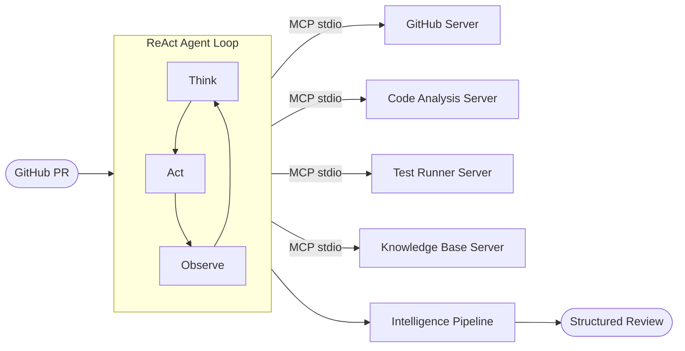

# MCP Code Review Agent

An autonomous code review agent built on the **Model Context Protocol (MCP)** — connects to GitHub, runs static analysis, executes tests, queries a knowledge base, and posts structured reviews with zero human intervention.


## Architecture

See [docs/architecture.md](docs/architecture.md) for the full Mermaid diagram.

```
PR URL → Fetch Metadata → Plan Review → ReAct Agent Loop (LLM ↔ MCP Tools) → Intelligence Pipeline → Structured Review → Post to GitHub
```



## Key Design Decisions

| Decision | Rationale |
|----------|-----------|
| **No LangChain** | Hand-rolled ReAct loop — demonstrates deep understanding of agent internals |
| **MCP protocol** | Standard tool interface — servers are independently testable and replaceable |
| **Deterministic planner** | Heuristic-based file prioritization before LLM loop — reduces token waste |
| **Intelligence pipeline** | 5-stage post-processing (severity, suggestions, confidence, cross-file, RAG) — adds signal the LLM misses |
| **Token budget** | Enforced per-review spending limits — prevents runaway costs |
| **Dual LLM support** | Anthropic + OpenAI — single `llm_provider` config switch |

## Features

### Core Agent
- **ReAct reasoning loop**: Think → Act → Observe cycle with automatic tool selection
- **4 MCP servers**: GitHub (5 tools), Code Analysis (3 tools), Test Runner (2 tools), Knowledge Base (2 tools)
- **Deterministic planner**: Analyzes file extensions, change size, risk patterns to prioritize review
- **Structured findings**: Severity (blocker/warning/nit/praise), file path, line number, suggestions

### Intelligence Layer
- **Severity re-classification**: Context-aware severity using rule databases (cosmetic vs. bug vs. security)
- **Auto-fix suggestions**: Pattern-matched fixes for common linter rules (F401, B006, E711, S105, S608, etc.)
- **Confidence scoring**: Multi-factor reliability rating (tool base score, FP adjustment, corroboration)
- **Cross-file analysis**: Detects missing tests, stale imports, API contract breaks, requirements drift
- **RAG enrichment**: Queries knowledge base for best-practice context on WARNING+ findings

### Production Hardening
- **Prometheus metrics**: Review counts, durations, tool calls, findings by severity, token usage
- **Distributed tracing**: Per-review trace context with span-level timing for each phase
- **Token budget controls**: Per-review input/output/total limits with cost estimation
- **GitHub webhook**: `POST /webhook` — auto-reviews PRs on open/synchronize, validates HMAC signature
- **Evaluation framework**: Benchmark suite with F1, recall, precision, severity accuracy metrics
- **Docker + Compose**: Single-command deployment
- **GitHub Actions CI**: Lint + test on every PR

### API
- **POST /review**: Full review → JSON response with findings, plan, stats
- **POST /review/stream**: SSE streaming of agent events (thinking, tool calls, findings)
- **POST /webhook**: GitHub webhook receiver for automated PR reviews
- **GET /health**: Liveness probe with server connection status
- **GET /metrics**: Prometheus metrics endpoint

## Project Structure

```
mcp-code-review-agent/
├── agent/
│   ├── core.py              # ReAct agent loop (Anthropic + OpenAI)
│   ├── client.py            # MCP client — connects to 4 servers via stdio
│   ├── prompts.py           # System prompt + review task template
│   ├── models.py            # Finding, ReviewResult, ReviewPlan, AgentEvent
│   ├── reviewer.py          # High-level orchestrator (plan → agent → intelligence)
│   ├── planner.py           # Deterministic heuristic review planner
│   ├── parser.py            # Parses raw MCP tool outputs → Finding objects
│   ├── budget.py            # Token budget tracking and enforcement
│   ├── observability.py     # Prometheus metrics + trace context
│   └── intelligence/
│       ├── pipeline.py      # 5-stage intelligence pipeline orchestrator
│       ├── severity.py      # Context-aware severity re-classification
│       ├── suggestions.py   # Pattern-based auto-fix suggestions
│       ├── confidence.py    # Multi-factor confidence scoring
│       ├── cross_file.py    # Cross-file reasoning (imports, tests, API)
│       └── rag.py           # Knowledge base enrichment via RAG
├── servers/
│   ├── github_server.py     # MCP server: get_pr_metadata, list_pr_files, get_file_contents, get_pr_diff, post_review
│   ├── analysis_server.py   # MCP server: run_ruff, run_mypy, check_complexity
│   ├── test_runner_server.py # MCP server: run_tests, check_coverage
│   └── knowledge_base_server.py # MCP server: ask_knowledge_base, search_knowledge_base
├── app/
│   ├── api.py               # FastAPI app (review, stream, webhook, metrics, health)
│   └── schemas.py           # Pydantic request/response models
├── eval/
│   ├── evaluate.py          # Evaluation framework (F1, recall, precision)
│   └── dataset.json         # Benchmark dataset (5 labeled PR scenarios)
├── tests/                   # 180+ tests (pytest)
├── docs/
│   └── architecture.md      # Architecture diagram (Mermaid)
├── config.py                # pydantic-settings configuration
├── main.py                  # CLI entry point
├── Dockerfile
├── docker-compose.yml
└── .github/workflows/ci.yml
```

## Quick Start

### 1. Install

```bash
python -m venv .venv && source .venv/bin/activate
pip install -r requirements.txt
```

### 2. Configure

```bash
cp .env.example .env
# Edit .env with your API keys:
#   ANTHROPIC_API_KEY=sk-...
#   GITHUB_TOKEN=ghp_...
```

### 3. Review a PR

```bash
# CLI
python main.py https://github.com/owner/repo/pull/123

# API
uvicorn app.api:app --port 8000
curl -X POST http://localhost:8000/review \
  -H "Content-Type: application/json" \
  -d '{"pr_url": "https://github.com/owner/repo/pull/123"}'
```

### 4. Docker

```bash
docker compose up --build
```

## Configuration

| Variable | Default | Description |
|----------|---------|-------------|
| `LLM_PROVIDER` | `anthropic` | `anthropic` or `openai` |
| `LLM_MODEL` | `claude-sonnet-4-20250514` | Model name |
| `ANTHROPIC_API_KEY` | — | Anthropic API key |
| `OPENAI_API_KEY` | — | OpenAI API key |
| `GITHUB_TOKEN` | — | GitHub PAT for PR access |
| `RAG_API_URL` | `http://localhost:8000` | Knowledge base API endpoint |
| `MAX_AGENT_STEPS` | `20` | Max ReAct loop iterations |
| `MAX_TOTAL_TOKENS` | `120000` | Token budget per review |
| `WEBHOOK_SECRET` | — | GitHub webhook HMAC secret |
| `LOG_LEVEL` | `INFO` | Logging level |
| `LOG_JSON` | `false` | JSON-formatted logs |

## Evaluation

The evaluation framework measures review quality against labeled benchmarks:

```bash
# Run evaluation (offline, against dataset.json)
PYTHONPATH=. python -c "
from eval.evaluate import load_benchmark
cases = load_benchmark('eval/dataset.json')
print(f'Loaded {len(cases)} benchmark cases')
for c in cases:
    print(f'  {c.pr_title}: {len(c.expected_findings)} expected findings')
"
```

Metrics: **F1 score**, finding recall, finding precision, severity accuracy, suggestion rate, file coverage, event correctness.

## Testing

```bash
PYTHONPATH=. pytest tests/ -v
```

## Development Timeline

| Week | Focus | Highlights |
|------|-------|------------|
| 1 | **Foundation** | MCP servers, ReAct agent core, tool discovery, CLI |
| 2 | **Structure** | Planner, parser, reviewer orchestrator, FastAPI API, 64 tests |
| 3 | **Intelligence** | Severity, suggestions, confidence, cross-file, RAG pipeline, 162 tests |
| 4 | **Production** | Metrics, tracing, token budget, webhook, eval framework, Docker, CI |

## License

MIT
