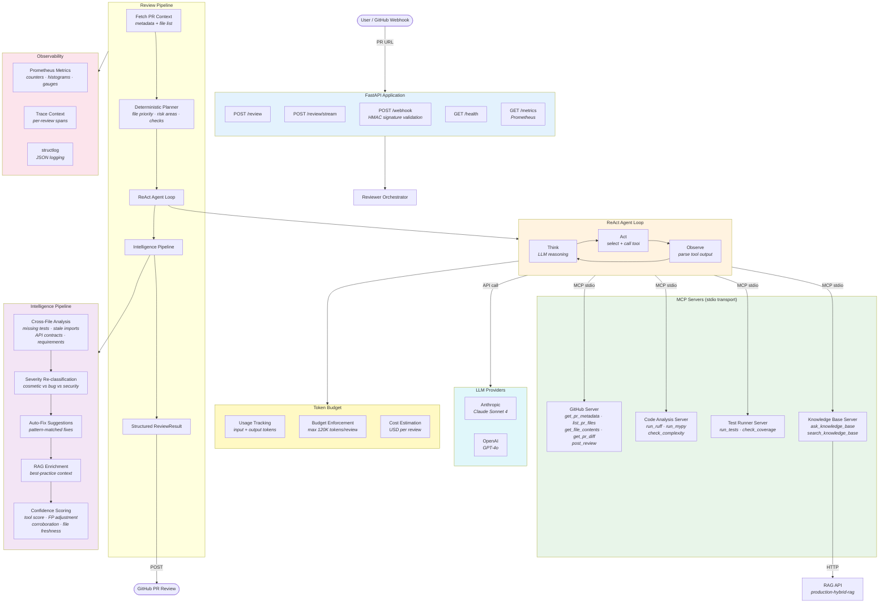

## Component Details

### ReAct Agent Loop

The agent follows the classic **ReAct** (Reasoning + Acting) pattern:

1. **Think**: The LLM reasons about what information it needs next
2. **Act**: It selects and calls an MCP tool (GitHub, linter, test runner, etc.)
3. **Observe**: The tool result is parsed and fed back to the LLM
4. **Repeat** until the LLM decides it has enough information to write the review

The loop is bounded by `MAX_AGENT_STEPS` (default 20) and a token budget.

### MCP Transport

All four servers communicate via **stdio transport** — the agent spawns each server as a subprocess and exchanges JSON-RPC messages over stdin/stdout. This is the standard MCP approach and means:

- Servers are independently testable (`python servers/github_server.py`)
- No network configuration needed for local development
- Any MCP-compatible client can use the servers

### Intelligence Pipeline

Post-processing pipeline that runs after the agent loop:

1. **Cross-file analysis**: Detects issues spanning multiple files (missing tests, broken imports, stale API callers)
2. **Severity re-classification**: Promotes/demotes findings based on rule databases and code context
3. **Auto-fix suggestions**: Generates before/after code snippets for known linter rules
4. **RAG enrichment**: Queries the knowledge base for best-practice context on high-severity findings
5. **Confidence scoring**: Rates each finding's reliability (0.0–1.0) using multiple factors

### Token Budget

Every review has a token budget that tracks:

- **Input tokens**: Content sent to the LLM (PR diffs, tool results, context)
- **Output tokens**: LLM responses (reasoning, tool calls, review text)
- **Total budget**: Hard cap prevents runaway costs (default 120K tokens)
- **Cost estimation**: Per-review USD cost based on model pricing

### Evaluation Framework

Offline evaluation against labeled benchmarks:

- **Gold findings**: Human-labeled expected issues per PR
- **Fuzzy matching**: File path + line proximity + keyword matching
- **Metrics**: F1 score, recall, precision, severity accuracy, suggestion rate
- **Dataset**: 5 benchmark PR scenarios covering security, refactoring, infra, trivial, and complex changes
